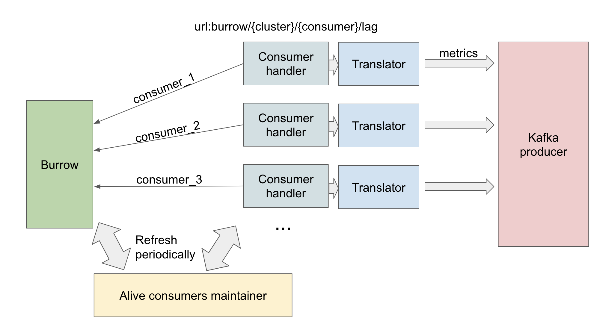

[](https://gitter.im/BurrowRainbow/community?utm_source=badge&utm_medium=badge&utm_campaign=pr-badge)
[](https://travis-ci.org/harbinzhang/goRainbow)
[](https://goreportcard.com/report/github.com/harbinzhang/goRainbow)
[](https://coveralls.io/github/harbinzhang/goRainbow?branch=dev-coverage)


# goRainbow
# What it is
goRainbow is a plug-in for [Burrow](https://github.com/linkedin/Burrow). Burrow is a Lag monitoring service for Apache Kafka.  

With goRainbow, it provides more visibility for Kafka users:  
1. Producer status: for each producer, how many records produced to each partition.
2. Consumer status: for each consumer, which partition(s) are hosted and how many records consumed per minute.
3. Lag: total lag in the whole consumer group and partition level lag.
4. Traffic statistics: It provides data traffic statistic.(totalMessage, validMessage, metricsSent, exceptionCount)
### Features
1. Heath-check: It provides health-check HTTP service so that AWS can auto restart Burrow-goRainbow when the service is unavailable.
2. Dynamic metric sending:
   1. It sends partition metrics when lag exists. Also it guarantees every metric starts from 0 and ends with 0, which shows better in wavefront.
   2. It sends metrics per 30s when metrics change and per 60s for unchanged metrics.
## Thanks
A big thanks to porter-rainbow, which gave me a basic idea about how to design the goRainbow.

port-rainbow is mainly based on socket connection. goRainbow is like a RESTful service.
# Rainbow structure

1. Each `consumer handler` is responsible for one consumer and has one specific url(`burrow/{cluster}/{consumer}`) to pull the consumer info from Burrow.
2. `alive consumers maintainer` checks Burrow periodically to see whether there is a new consumer or not. If so, it would raise a new `consumer handler` for the new consumer.
3. `consumer handler` would deregister itself in `alive consumers maintainer` when its consumer is not valid any longer.
# Metrics format
### Consumer level
1. consumer totalLag:
   - "fjord.burrow.${env}.${consumer}.totalLag ${totalLag} ${timestamp} ${tags}"
2. consumer maxLag partition:
   - "fjord.burrow.${env}.${consumer}.maxLagmaxLagPartitionID ${value} ${timestamp} ${tags}"
   - "fjord.burrow.${env}.${consumer}.maxLagCurrentLag ${value} ${timestamp} ${tags}"
   - "fjord.burrow.${env}.${consumer}.maxLagStartOffset ${value} ${timestamp} ${tags}"
   - "fjord.burrow.${env}.${consumer}.maxLagEndOffset ${value} ${timestamp} ${tags}"
   - "fjord.burrow.${env}.${consumer}.maxLagTopic ${value} ${timestamp} ${tags}"
3. consumer all paritions(when totalLag is above 0):
   - "fjord.burrow.${env}.${consumer}.${partitionId}.currentLag ${value} ${timestamp} ${tags}"
   - "fjord.burrow.${env}.${consumer}.${partitionId}.startOffset ${value} ${timestamp} ${tags}"
   - "fjord.burrow.${env}.${consumer}.${partitionId}.endOffset ${value} ${timestamp} ${tags}"
### Topic level
- Topic level offset shows the kafka-producer offset in each partition.
   - "fjord.burrow.${env}.topic.${partitionId}.offset ${value} ${timestamp} ${tags}"
# High-level
goRainbow includes 3 main parts:
1. URL maintainer: maintain available URLs, create new handler thread for new URL.
2. URL handler: translates data into required form, prepared for producer.
3. kafka producer: sends data to kafka(speed-racer), which will send metrics to the Wavefront.
# Usage
### For Burrow
You may check [Burrow Dockerfile](burrow/Dockerfile) for how to use goRainbow.
Also, [Burrow Inspection](burrow/README.md) is my understanding of Burrow code.
### Program
The main program is goRainbow.go
```
go run goRainbow.go
```
It will open health_check port at localhost:7099
- health-check: localhost:7099/health-check
  - return 200 if service is available
  - return 503 if service is unavailable
### Burrow push-model
Also goRainbow provides a Burrow-push-model, in which goRainbow accepts Burrow's Lag message via Burrow notifier. It's working fine, but goRainbow pull-model can provide a better precision.   
You may check rainbow-push-model branch for details. [push-model](https://github.com/harbinzhang/goRainbow/tree/rainbow-push-model)
### Some implements
1. Avoid blocking operation in main pipeline.
   1. Refined nested sync map to avoid blocking in URL maintainer.
   2. leave heavy workload to goroutine.
2. Twin-state-machine to guarantee metrics start and end with 0.